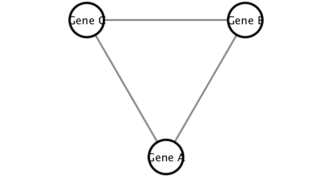
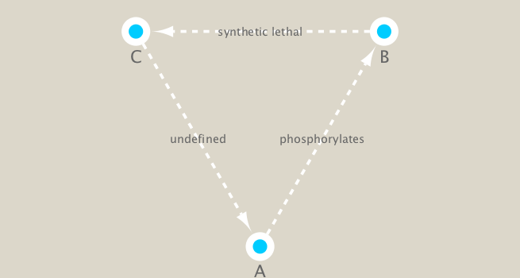
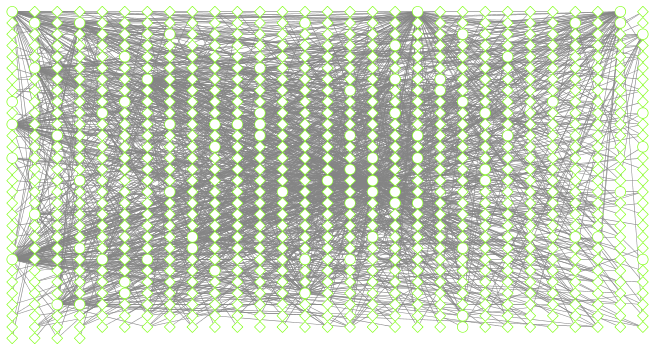
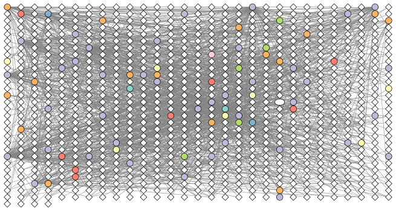

Metagenomics co-occurence networks
================
Barry Grant (<bjgrant@ucsd.edu>)

**BGGN-213 Lecture 17:**  
Barry Grant &lt; <http://thegrantlab.org> &gt;  
Date: 2018-05-30 (10:36:01 PDT on Wed, May 30)  
{:.message} 

Overview
========

Tara Oceans
-----------

Many projects have collected samples from different regions and from different depths of the ocean. Some, such as the pioneering study by Craig Venter (Venter et al. 2004) have pioneered metagenomic sequencing and others, such as [Tara Oceans Expedition](http://oceans.taraexpeditions.org/) have collected large amounts of data with global ecological questions in mind. On the Tara Oceans ([8th and 9th expedition for this vessel](http://oceans.taraexpeditions.org/en/m/about-tara/les-expeditions/tara-oceans/)) researchers used a small sailboat outfitted with a lab and filtration supplies to collect samples from many different size fractions of microorganisms in the oceans over three years. They collected these samples to look at the different kinds of microorganisms present in different parts of the oceans to look at their composition and to observe their spatial patterns and distribution.

The scientists collected the samples and then used either targeted sequencing (amplicon approach using primers for specific targets such as the ribosomal genes and then amplifying these targets using PCR) or using metagenomic sequencing (where all the genetic material in a sample is sequenced) of each of the size fractions.

After the sequencing and quality checking of the samples was done, the sequences were taxonomically classified (different approaches for the different targets, see here for the details in Brum et al. (2015) and Sunagawa et al. (2015)). After that the data could be made into a species occurrence table where the rows are different sites and the columns are the observations of the different organisms at each site (Lima-Mendez et al. 2015).

How to examine organisms that occur together: co-occurence networks
-------------------------------------------------------------------

Many of these microbial species in these types of studies have not yet been characterized in the lab. Thus, to know more about the organisms and their interactions, we can observe which ones occur at the same sites or under the same kinds of environmental conditions. One way to do that is by using co-occurrence networks where you examine which organisms occur together at which sites. The more frequently that organisms co-occur at the same site, the stronger the interaction predicted among these organisms. For a review of some of the different kinds of techniques and software for creating interaction networks see: Weiss et al. (2016).

What can we find out by creating co-occurence networks?
-------------------------------------------------------

These kinds of analyses can be useful for studies where the organisms have not yet been characterized in the lab because these analyses can provide insights about the communities and how the organisms within them are interacting. These analyses can be exploratory, so that we can see which organisms warrant further insights and perhaps experimental work. We can also learn about how the overall community is organized (community structure) by looking at some of the network properties (that is the overall way that the organisms are co-occurring and the properties of the network seen this way).

Our data for this hands-on section
----------------------------------

In this analysis we are using a Tara Ocean data and we have data from the bacterial dataset (Sunagawa et al. 2015) and also from the viral dataset (Brum et al. 2015). They have been examined in Lima-Mendez et al. (2015) and we have used the original relative abundances to visualize the data. Data were retrieved from: <http://www.raeslab.org/companion/ocean-interactome.html>

Set up Cytoscape and R connection
=================================

We will run this example using the R bioconductor package **RCy3** (see: <http://bioconductor.org/packages/release/bioc/html/RCy3.html> ) to drive the visualization of these networks in **Cytoscape** (see: <http://cytoscape.org> ).

Requirements
------------

``` r
library(RCy3)
library(igraph)
library(RColorBrewer)
```

If you received an error message or have not installed any of these packages yet then you will likely need to do a one-time only package install within R, e.g.

### Installation

The whole point of RCy3 package is to connect with Cytoscape. You will need to install and launch Cytoscape if you have not already done so:

-   [Download Cytoscape](http://www.cytoscape.org/download.php)
-   Complete the installation wizard
-   Launch Cytoscape

> **NOTE**: To run this lab the **Cytoscape software must be running** (i.e. you should have it installed and open!).

### First Contact

These functions are a convenient way to verify a connection to Cytoscape and for logging the versions of CyREST and Cytoscape in your scripts.

``` r
library(RCy3)
cwd <- demoSimpleGraph()
```

    ## [1] "type"
    ## [1] "lfc"
    ## [1] "label"
    ## [1] "count"
    ## [1] "edgeType"
    ## [1] "score"
    ## [1] "misc"
    ## Successfully set rule.
    ## Successfully set rule.
    ## Locked node dimensions successfully even if the check box is not ticked.
    ## Locked node dimensions successfully even if the check box is not ticked.
    ## Successfully set rule.
    ## Successfully set rule.

``` r
layoutNetwork(cwd, 'force-directed')

# choose any of the other possible layouts e.g.:
possible.layout.names <- getLayoutNames(cwd)
layoutNetwork (cwd, possible.layout.names[1])

# Test the connection to Cytoscape.
ping(cwd)
```

    ## [1] "It works!"

If you turn to your Cytoscape window you should now see a simple 3 vertex and 3 edge network displayed (see below).

We can include this Cytoscape rendered network image in our report with the following code:

``` r
saveImage(cwd,
          file.name="demo",
          image.type="png",
          h=350)
```

``` r

```


### Switch Styles

Cytoscape provides a number of canned visual styles. The code below explores some of these styles. For example check out the marquee style!

``` r
setVisualStyle(cwd, "Marquee")
```

    ## network visual style has been set to "Marquee"

If you turn to your Cytoscape window you should now see an updated stylized network displayed (see below).

``` r
saveImage(cwd,
          file.name="demo_marquee",
          image.type="png",
          h=350)


```


You can find out what other styles are available and try a couple:

``` r
styles <- getVisualStyleNames(cwd)
styles
```

    ##  [1] "Big Labels"           "Sample3"              "Curved"              
    ##  [4] "Gradient1"            "Directed"             "Solid"               
    ##  [7] "default black"        "Nested Network Style" "BioPAX_SIF"          
    ## [10] "Ripple"               "Sample1"              "BioPAX"              
    ## [13] "default"              "size_rank"            "Minimal"             
    ## [16] "Sample2"              "Marquee"              "Universe"

Let try some other styles, e.g.

``` r
#setVisualStyle(cwd, styles[13])
#setVisualStyle(cwd, styles[18])
```

Now we know that out connection between R and Cytoscape is running we can get to work with our real metagenomics data. Our first step is to read our data into R itself.

Read our metagenomics data
--------------------------

We will read in a species co-occurrence matrix that was calculated using Spearman Rank coefficient. (see reference Lima-Mendez et al. (2015) for details).

    ## Warning in dir.create("data"): 'data' already exists

``` r
## scripts for processing located in "inst/data-raw/"
prok_vir_cor <- read.delim("./data/virus_prok_cor_abundant.tsv", stringsAsFactors = FALSE)

## Have a peak at the first 6 rows
head(prok_vir_cor)
```

    ##       Var1          Var2    weight
    ## 1  ph_1061 AACY020068177 0.8555342
    ## 2  ph_1258 AACY020207233 0.8055750
    ## 3  ph_3164 AACY020207233 0.8122517
    ## 4  ph_1033 AACY020255495 0.8487498
    ## 5 ph_10996 AACY020255495 0.8734617
    ## 6 ph_11038 AACY020255495 0.8740782

There are many different ways to work with graphs in R. We will primarily use the **igraph** package (see: <http://igraph.org/r/> ) and also work with our network within Cytoscape.

Here we will use the igraph package to convert the co-occurrence dataframe into a network that we can send to Cytoscape. In this case our graph is undirected (so we will set `directed = FALSE`) since we do not have any information about the direction of the interactions from this type of data.

``` r
g <- graph.data.frame(prok_vir_cor, directed = FALSE)
```

We can check the class of our new object `g` and see that is is of class `igraph`. Therefor the **print.igraph()** function will be called when we type it's name allowing us have an informative overview of the graph structure.

``` r
class(g)
```

    ## [1] "igraph"

``` r
g
```

    ## IGRAPH 27870ee UNW- 845 1544 -- 
    ## + attr: name (v/c), weight (e/n)
    ## + edges from 27870ee (vertex names):
    ##  [1] ph_1061 --AACY020068177 ph_1258 --AACY020207233
    ##  [3] ph_3164 --AACY020207233 ph_1033 --AACY020255495
    ##  [5] ph_10996--AACY020255495 ph_11038--AACY020255495
    ##  [7] ph_11040--AACY020255495 ph_11048--AACY020255495
    ##  [9] ph_11096--AACY020255495 ph_1113 --AACY020255495
    ## [11] ph_1208 --AACY020255495 ph_13207--AACY020255495
    ## [13] ph_1346 --AACY020255495 ph_14679--AACY020255495
    ## [15] ph_1572 --AACY020255495 ph_16045--AACY020255495
    ## + ... omitted several edges

In this case the first line of output ("**UNW- 854 1544 --**") tells that our network graph has 845 vertices (i.e. nodes, which represent our bacteria and viruses) and 1544 edges (i.e. linking lines, which indicate their co-occurrence). Note that the first four characters (i.e. the "**UNW-**" part) tell us about the network setup. In this case our network is **U**ndirected, **N**amed (i.e. has the 'name' node/vertex attribute set) and **W**eighted (i.e. the 'weight' edge attribute is set).

Common igraph functions for creating network graphs include: **graph\_from\_data\_frame()**, **graph\_from\_edgelist()**, and **graph\_from\_adjacency\_matrix()**. You can find out more about these functions from their associated help pages.

Our current graph is a little too dense in terms of node labels etc. to have a useful 'default' plot figure. But we can have a look anyway.

``` r
plot(g)
```


This is a hot-mess! Lets turn of the blue text labels

``` r
plot(g, vertex.label=NA)
```


The nodes/vertex are too big. Lets make them smaller...

``` r
plot(g, vertex.size=3, vertex.label=NA)
```


To find out more about igraph network plot options see <http://igraph.org/r/doc/plot.common.html>. Note that we can tune lots of plot attributes (see the help page `?igraph.plotting` for details). Here we just turned down our vertex size from the default value of 15 and turned of our vertex labels.

Optional: If you are in love with ggplot
----------------------------------------

You can also use the **ggplot** extension package for networks called **ggraph**. You will likely have to run `install.packages("ggraph")` the first time you run the below code:

``` r
library(ggraph)
```

    ## Warning: package 'ggraph' was built under R version 3.4.3

    ## Loading required package: ggplot2

``` r
ggraph(g, layout = 'auto') +
  geom_edge_link(alpha = 0.25) +
  geom_node_point(color="lightblue")
```

    ## Using `nicely` as default layout


Network querys
--------------

Note that we can query (and set) vertex and edge attributes with the **V()** and **E()** functions respectively:

``` r
V(g)
```

    ## + 845/845 vertices, named, from 27870ee:
    ##   [1] ph_1061       ph_1258       ph_3164       ph_1033       ph_10996     
    ##   [6] ph_11038      ph_11040      ph_11048      ph_11096      ph_1113      
    ##  [11] ph_1208       ph_13207      ph_1346       ph_14679      ph_1572      
    ##  [16] ph_16045      ph_1909       ph_1918       ph_19894      ph_2117      
    ##  [21] ph_2231       ph_2363       ph_276        ph_2775       ph_2798      
    ##  [26] ph_3217       ph_3336       ph_3493       ph_3541       ph_3892      
    ##  [31] ph_4194       ph_4602       ph_4678       ph_484        ph_4993      
    ##  [36] ph_4999       ph_5001       ph_5010       ph_5286       ph_5287      
    ##  [41] ph_5302       ph_5321       ph_5643       ph_6441       ph_654       
    ##  [46] ph_6954       ph_7389       ph_7920       ph_8039       ph_8695      
    ## + ... omitted several vertices

``` r
E(g)
```

    ## + 1544/1544 edges from 27870ee (vertex names):
    ##  [1] ph_1061 --AACY020068177 ph_1258 --AACY020207233
    ##  [3] ph_3164 --AACY020207233 ph_1033 --AACY020255495
    ##  [5] ph_10996--AACY020255495 ph_11038--AACY020255495
    ##  [7] ph_11040--AACY020255495 ph_11048--AACY020255495
    ##  [9] ph_11096--AACY020255495 ph_1113 --AACY020255495
    ## [11] ph_1208 --AACY020255495 ph_13207--AACY020255495
    ## [13] ph_1346 --AACY020255495 ph_14679--AACY020255495
    ## [15] ph_1572 --AACY020255495 ph_16045--AACY020255495
    ## [17] ph_1909 --AACY020255495 ph_1918 --AACY020255495
    ## [19] ph_19894--AACY020255495 ph_2117 --AACY020255495
    ## + ... omitted several edges

There are also the functions **vertex.attributes()** and **edge.attributes()** that query all vertex and edge attributes of a igraph object. We will use one of these functions in the next section below.

Network community detection
---------------------------

Community structure detection algorithms try to find dense subgraphs within larger network graphs (i.e. clusters of well connected nodes that are densely connected themselves but sparsely connected to other nodes outside the cluster) . Here we use the classic Girvan & Newman betweenness clustering method. The igraph package has lots of different community detection algorithms (i.e. different methods for finding communities).

``` r
cb <- cluster_edge_betweenness(g)
cb
```

    ## IGRAPH clustering edge betweenness, groups: 18, mod: 0.82
    ## + groups:
    ##   $`1`
    ##   [1] "ph_1061"       "AACY020068177"
    ##   
    ##   $`2`
    ##    [1] "ph_1258"       "ph_5861"       "ph_7172"       "ph_11569"     
    ##    [5] "ph_1291"       "ph_1600"       "ph_2702"       "ph_5790"      
    ##    [9] "ph_5858"       "ph_7594"       "ph_7816"       "ph_784"       
    ##   [13] "ph_1359"       "ph_1534"       "ph_1874"       "ph_2465"      
    ##   [17] "ph_5453"       "ph_900"        "ph_908"        "ph_811"       
    ##   [21] "ph_1367"       "ph_1452"       "ph_1458"       "ph_1723"      
    ##   + ... omitted several groups/vertices

``` r
plot(cb, y=g, vertex.label=NA,  vertex.size=3)
```


You can extract a cluster/community membership vector for further inspection with the **membership()** function:

``` r
head( membership(cb) )
```

    ##  ph_1061  ph_1258  ph_3164  ph_1033 ph_10996 ph_11038 
    ##        1        2        3        4        4        4

Node degree
-----------

The degree of a node or vertex is its most basic structural property, the number of its adjacent edges. Here we calculate and plot the node degree distribution.

> Note again the scale-free nature of this network with a small number of nodes with high degree values and many nodes with low degree values.

``` r
# Calculate and plot node degree of our network
d <- degree(g)
hist(d, breaks=30, col="lightblue", main ="Node Degree Distribution")
```


For the **degree\_distribution()** function a numeric vector of the same length as the maximum degree plus one is returned. The first element is the relative frequency zero degree vertices, the second vertices with degree one, etc.

``` r
plot( degree_distribution(g), type="h" )
```


Centrality analysis
-------------------

Centrality gives an estimation on how important a node or edge is for the connectivity (or the information flow) of a network. It is a particularly useful parameter in signaling networks and it is often used when trying to find drug targets for example.

Centrality analysis often aims to answer the following question: Which nodes are the most important and why?

One centrality method that you can often find in publications is the Google PageRank score. For the explanation of the PageRank algorithm, see the following webpage: <http://infolab.stanford.edu/~backrub/google.html>

``` r
pr <- page_rank(g)
head(pr$vector)
```

    ##      ph_1061      ph_1258      ph_3164      ph_1033     ph_10996 
    ## 0.0011834320 0.0011599483 0.0019042088 0.0005788564 0.0005769663 
    ##     ph_11038 
    ## 0.0005745460

Lets plot our network with nodes size scaled via this page rank centrality scores.

``` r
# Make a size vector btwn 2 and 20 for node plotting size
v.size <- BBmisc::normalize(pr$vector, range=c(2,20), method="range")
plot(g, vertex.size=v.size, vertex.label=NA)
```


One of the simplest centrality scores is of course degree that we calculated previously and stored as the object `d`. Lets plot this one out also

``` r
v.size <- BBmisc::normalize(d, range=c(2,20), method="range")
plot(g, vertex.size=v.size, vertex.label=NA)
```


Another very common centrality score is betweenness. The vertex and edge betweenness are (roughly) defined by the number of geodesics (shortest paths) going through a vertex or an edge.

``` r
b <- betweenness(g)
v.size <- BBmisc::normalize(b, range=c(2,20), method="range")
plot(g, vertex.size=v.size, vertex.label=NA)
```


Read taxonomic classification for network annotation
====================================================

Since these are data from small, microscopic organisms that were sequenced using shotgun sequencing, we rely on the classification of the sequences to know what kind of organisms are in the samples. In this case the bacterial viruses (bacteriophage), were classified by Basic Local Alignment Search Tool (BLAST <http://blast.ncbi.nlm.nih.gov/Blast.cgi>) by searching for their closest sequence in the RefSeq database (see methods in Brum et al. (2015)). The prokaryotic taxonomic classifications were determined using the SILVA database.

``` r
phage_id_affiliation <- read.delim("./data/phage_ids_with_affiliation.tsv")
head(phage_id_affiliation)
```

    ##   first_sheet.Phage_id first_sheet.Phage_id_network phage_affiliation
    ## 1        109DCM_115804                       ph_775              <NA>
    ## 2        109DCM_115804                       ph_775              <NA>
    ## 3        109DCM_115804                       ph_775              <NA>
    ## 4        109DCM_115804                       ph_775              <NA>
    ## 5        109DCM_115804                       ph_775              <NA>
    ## 6        109DCM_115804                       ph_775              <NA>
    ##   Domain DNA_or_RNA Tax_order Tax_subfamily Tax_family Tax_genus
    ## 1   <NA>       <NA>      <NA>          <NA>       <NA>      <NA>
    ## 2   <NA>       <NA>      <NA>          <NA>       <NA>      <NA>
    ## 3   <NA>       <NA>      <NA>          <NA>       <NA>      <NA>
    ## 4   <NA>       <NA>      <NA>          <NA>       <NA>      <NA>
    ## 5   <NA>       <NA>      <NA>          <NA>       <NA>      <NA>
    ## 6   <NA>       <NA>      <NA>          <NA>       <NA>      <NA>
    ##   Tax_species
    ## 1        <NA>
    ## 2        <NA>
    ## 3        <NA>
    ## 4        <NA>
    ## 5        <NA>
    ## 6        <NA>

``` r
bac_id_affi <- read.delim("./data/prok_tax_from_silva.tsv", stringsAsFactors = FALSE)
head(bac_id_affi)
```

    ##    Accession_ID  Kingdom         Phylum          Class             Order
    ## 1 AACY020068177 Bacteria    Chloroflexi   SAR202 clade marine metagenome
    ## 2 AACY020125842  Archaea  Euryarchaeota Thermoplasmata Thermoplasmatales
    ## 3 AACY020187844  Archaea  Euryarchaeota Thermoplasmata Thermoplasmatales
    ## 4 AACY020105546 Bacteria Actinobacteria Actinobacteria             PeM15
    ## 5 AACY020281370  Archaea  Euryarchaeota Thermoplasmata Thermoplasmatales
    ## 6 AACY020147130  Archaea  Euryarchaeota Thermoplasmata Thermoplasmatales
    ##              Family             Genus Species
    ## 1              <NA>              <NA>    <NA>
    ## 2   Marine Group II marine metagenome    <NA>
    ## 3   Marine Group II marine metagenome    <NA>
    ## 4 marine metagenome              <NA>    <NA>
    ## 5   Marine Group II marine metagenome    <NA>
    ## 6   Marine Group II marine metagenome    <NA>

Add taxonomic annotation data to network
----------------------------------------

In preparation for sending the networks to Cytoscape we will add in the taxonomic data.

> **Side-Note**: Some of the organisms do not have taxonomic classifications associated with them and these will get **NA** values below. Note that with earlier version of RCy3 I found problems sending "NA"s to Cytoscape from RCy3. The RCy3 package is under active development currently and this *issue* has apparently been resolved.

``` r
## Extract out our vertex names
genenet.nodes <- as.data.frame(vertex.attributes(g), stringsAsFactors=FALSE)
head(genenet.nodes)
```

    ##       name
    ## 1  ph_1061
    ## 2  ph_1258
    ## 3  ph_3164
    ## 4  ph_1033
    ## 5 ph_10996
    ## 6 ph_11038

How may phage (i.e. *ph\_*) entries do we have?

``` r
length( grep("^ph_",genenet.nodes[,1]) )
```

    ## [1] 764

Therefore we have 81 non phage nodes.

Now lets **merge()** these with the annotation data

``` r
# We dont need all annotation data so lets make a reduced table 'z' for merging
z <- bac_id_affi[,c("Accession_ID", "Kingdom", "Phylum", "Class")]
n <- merge(genenet.nodes, z, by.x="name", by.y="Accession_ID", all.x=TRUE)
head(n)
```

    ##            name  Kingdom          Phylum               Class
    ## 1 AACY020068177 Bacteria     Chloroflexi        SAR202 clade
    ## 2 AACY020207233 Bacteria Deferribacteres     Deferribacteres
    ## 3 AACY020255495 Bacteria  Proteobacteria Gammaproteobacteria
    ## 4 AACY020288370 Bacteria  Actinobacteria      Acidimicrobiia
    ## 5 AACY020396101 Bacteria  Actinobacteria      Acidimicrobiia
    ## 6 AACY020398456 Bacteria  Proteobacteria Gammaproteobacteria

``` r
# Check on the column names before deciding what to merge
colnames(n)
```

    ## [1] "name"    "Kingdom" "Phylum"  "Class"

``` r
colnames(phage_id_affiliation)
```

    ##  [1] "first_sheet.Phage_id"         "first_sheet.Phage_id_network"
    ##  [3] "phage_affiliation"            "Domain"                      
    ##  [5] "DNA_or_RNA"                   "Tax_order"                   
    ##  [7] "Tax_subfamily"                "Tax_family"                  
    ##  [9] "Tax_genus"                    "Tax_species"

``` r
# Again we only need a subset of `phage_id_affiliation` for our purposes
y <- phage_id_affiliation[, c("first_sheet.Phage_id_network", "phage_affiliation","Tax_order", "Tax_subfamily")]

# Add the little phage annotation that we have
x <- merge(x=n, y=y, by.x="name", by.y="first_sheet.Phage_id_network", all.x=TRUE)

## Remove duplicates from multiple matches
x <- x[!duplicated( (x$name) ),]
head(x)
```

    ##            name  Kingdom          Phylum               Class
    ## 1 AACY020068177 Bacteria     Chloroflexi        SAR202 clade
    ## 2 AACY020207233 Bacteria Deferribacteres     Deferribacteres
    ## 3 AACY020255495 Bacteria  Proteobacteria Gammaproteobacteria
    ## 4 AACY020288370 Bacteria  Actinobacteria      Acidimicrobiia
    ## 5 AACY020396101 Bacteria  Actinobacteria      Acidimicrobiia
    ## 6 AACY020398456 Bacteria  Proteobacteria Gammaproteobacteria
    ##   phage_affiliation Tax_order Tax_subfamily
    ## 1              <NA>      <NA>          <NA>
    ## 2              <NA>      <NA>          <NA>
    ## 3              <NA>      <NA>          <NA>
    ## 4              <NA>      <NA>          <NA>
    ## 5              <NA>      <NA>          <NA>
    ## 6              <NA>      <NA>          <NA>

Save our merged annotation results back to `genenet.nodes`.

``` r
genenet.nodes <- x
```

Add to the network the data related to the connections between the organisms, the edge data, and then prepare to send the nodes and edges to Cytoscape using the function `cyPlot()`.

``` r
genenet.edges <- data.frame(igraph::as_edgelist(g))
names(genenet.edges) <- c("name.1",
                          "name.2")
genenet.edges$Weight <- igraph::edge_attr(g)[[1]]

genenet.edges$name.1 <- as.character(genenet.edges$name.1)
genenet.edges$name.2 <- as.character(genenet.edges$name.2)
genenet.nodes$name <- as.character(genenet.nodes$name)

ug <- cyPlot(genenet.nodes,genenet.edges)
```

Send network to Cytoscape using RCy3
------------------------------------

Now we will send the network from R to Cytoscape.

To begin we create a connection in R that we can use to manipulate the networks and then we will delete any windows that were already in Cytoscape so that we don't use up all of our memory.

``` r
# Open a new connection and delete any existing windows/networks in Cy
cy <- CytoscapeConnection()
deleteAllWindows(cy)
```

If you tun back to your Cytoscape window you should now see that all previous networks have been removed from the open display.

``` r
cw <- CytoscapeWindow("Tara oceans",
                      graph = ug,
                      overwriteWindow = TRUE)
```

If you tun back to your Cytoscape window you should now see a new Network window listed as "Tara oceans". However, as of yet there will be no network graph displayed as we have not called the **displayGraph()** function to Cytoscape yet.

``` r
displayGraph(cw)
layoutNetwork(cw)
fitContent(cw)
```


Our network display of our data is now there in Cytoscape. It is just not very pretty yet! Note that you may have to zoom in to see anything in the Cytoscape window. We will work on this in the next few sections.

Colour network by prokaryotic phylum
------------------------------------

We would like to get an overview of the different phylum of bacteria that are in the network. One way is to color the different nodes based on their phylum classification. The package Rcolorbrewer will be used to generate a set of good colors for the nodes.

``` r
families_to_colour <- unique(genenet.nodes$Phylum)
families_to_colour <- families_to_colour[!is.na(families_to_colour)]

node.colour <- RColorBrewer::brewer.pal(length(families_to_colour), "Set3")
```

Color things up

``` r
setNodeColorRule(cw,
                 "Phylum",
                 families_to_colour,
                 node.colour,
                 "lookup",
                 default.color = "#ffffff")
```

    ## Successfully set rule.

And take a pic

``` r
saveImage(cw,
          file.name="net2",
          image.type="png",
          h=350)
```

``` r
library(knitr)
```

    ## Warning: package 'knitr' was built under R version 3.4.3

``` r

```


Set node shape to reflect virus or prokaryote
---------------------------------------------

Next we would like to change the shape of the node to reflect whether the nodes are viral or prokaryotic in origin. In this dataset all of the viral node names start with "ph\_", thus we can set the viral nodes to be diamond-shaped by looking for all the nodes that start with "ph" in the network.

``` r
shapes_for_nodes <- c("DIAMOND")

phage_names <- grep("ph_",
                    genenet.nodes$name,
                    value = TRUE)
setNodeShapeRule(cw,
                 "label",
                 phage_names,
                 shapes_for_nodes)
```

    ## Successfully set rule.

``` r
displayGraph(cw)
fitContent(cw)
```


Colour edges of phage nodes
---------------------------

The classification of the viral data was done in a very conservative manner so not many of the viral nodes were identified. However, if we do want to add some of this information to our visualization we can color the edges of the viral nodes by family. The main families that were identified in this dataset are the *Podoviridae*, the *Siphoviridae* and the *Myoviridae* (for more info see [NCBI Podoviridae](http://www.ncbi.nlm.nih.gov/Taxonomy/Browser/wwwtax.cgi?mode=Info&id=10744&lvl=3&p=7&lin=f&keep=1&srchmode=1&unlock), [NCBI Myoviridae](http://www.ncbi.nlm.nih.gov/Taxonomy/Browser/wwwtax.cgi?mode=Tree&id=10662&lvl=3&p=7&lin=f&keep=1&srchmode=1&unlock), and [NCBI Siphoviridae](http://www.ncbi.nlm.nih.gov/Taxonomy/Browser/wwwtax.cgi?mode=Tree&id=10699&lvl=3&p=7&lin=f&keep=1&srchmode=1&unlock))

``` r
setDefaultNodeBorderWidth(cw, 5)
families_to_colour <- c("Podoviridae",
                        "Siphoviridae",
                        "Myoviridae")

node.colour <- RColorBrewer::brewer.pal(length(families_to_colour),
                          "Dark2")
setNodeBorderColorRule(cw,
                       "Tax_subfamily",
                       families_to_colour,
                       node.colour,
                       "lookup", 
                       default.color = "#000000")
```

    ## Successfully set rule.

``` r
displayGraph(cw)
fitContent(cw)
```

``` r
saveImage(cw,
          "co-occur2",
          "png",
          h=350)

```


Use a network layout to minimize the overlap of nodes.
------------------------------------------------------

After doing all of this coloring to the network we would like to layout the network in a way that allows us to more easily see which nodes are connected without overlap. To do this we will change the layout.

When using RCy3 to drive Cytoscape, if we are not sure what the current values are for a layout or we are not sure what kinds of values are accepted for the different parameters of our layout, we can investigate using the RCy3 functions `getLayoutPropertyNames()` and then `getLayoutPropertyValue()`.

``` r
getLayoutNames(cw)
```

    ##  [1] "attribute-circle"      "stacked-node-layout"  
    ##  [3] "degree-circle"         "circular"             
    ##  [5] "attributes-layout"     "kamada-kawai"         
    ##  [7] "force-directed"        "cose"                 
    ##  [9] "grid"                  "hierarchical"         
    ## [11] "fruchterman-rheingold" "isom"                 
    ## [13] "force-directed-cl"

``` r
getLayoutPropertyNames(cw, layout.name="force-directed")
```

    ## [1] "numIterations"            "defaultSpringCoefficient"
    ## [3] "defaultSpringLength"      "defaultNodeMass"         
    ## [5] "isDeterministic"          "singlePartition"

``` r
getLayoutPropertyValue(cw, "force-directed", "defaultSpringLength") 
```

    ## [1] 50

``` r
getLayoutPropertyValue(cw, "force-directed", "numIterations")  
```

    ## [1] 100

Once we decide on the properties we want, we can go ahead and set fine-grained properties of a given layout like this:

``` r
#setLayoutProperties(cw,
#                    layout.name = force-directed",
#                    list(defaultSpringLength = 20,
#                         "numIterations" = 200))
#layoutNetwork(cw,
#              layout.name = "force-directed")
#fitContent(cw)
```

For now let's just use the default *force-directed* layout.

``` r
layoutNetwork(cw, layout.name = "force-directed")
fitContent(cw)
```


Look at network properties
==========================

One thing that might be interesting to visualize is nodes that are connected to many different nodes and nodes that are connected to few other nodes. The number of other nodes to which one node is connected is called **degree**. We can use a gradient of size to quickly visualize nodes that have high degree.

``` r
## initiate a new node attribute
ug2 <- initNodeAttribute(graph = ug,
                          "degree",
                          "numeric",
                          0.0) 

## Use the igraph to calculate degree from the original graph
nodeData(ug2, nodes(ug2), "degree") <- igraph::degree(g)

cw2 <- CytoscapeWindow("Tara oceans with degree",
                      graph = ug2,
                      overwriteWindow = TRUE)
```

``` r
displayGraph(cw2)
layoutNetwork(cw2)
```

Size by degree
==============

``` r
degree_control_points <- c(min(igraph::degree(g)),
                           mean(igraph::degree(g)),
                           max(igraph::degree(g)))
node_sizes <- c(20,
                20,
                80,
                100,
                110) # number of control points in interpolation mode,
                     # the first and the last are for sizes "below" and "above" the attribute seen.

setNodeSizeRule(cw2,
                "degree",
                degree_control_points,
                node_sizes,
                mode = "interpolate")
```

    ## Locked node dimensions successfully even if the check box is not ticked.
    ## Locked node dimensions successfully even if the check box is not ticked.
    ## Successfully set rule.

``` r
layoutNetwork(cw2,
              "force-directed")
```


Publishing your network to NDEx-
--------------------------------

The new [NDEx (Network Data Exchange) web server](http://www.ndexbio.org/) provides an open-source framework where scientists and organizations can share, store, manipulate, and publish biological network knowledge (Pillich et al. 2017). It is developed here at UCSD in close collaboration with the Cytoscape development team. Once you have an account on the web server you can upload your networks directly from Cytoscape or use the bioconductor R package **ndexR**.

Visit the NDEx homepage <http://www.ndexbio.org> and create a new account for yourself. You will need to recall your username and password in a later step.

### Exporting from Cytoscape

Back in Cytoscape with your final (for now) network displayed. Click on **File** &gt; **Export** &gt; **Network to NDXe...**. On the window that appears make sure you are logged in by entering your NDEx username and password (see red box number 1 in figure below). Then fill in as much annotation as you can add. It is important that you make your network Public (see red box number 2 in figure). When you are ready click the **Save** button.


Now return to your web browser and on the NDEx home page click your username in the top tool-bar and find your network under the **My Networks** tab. You can share the URL of your network with others you work with.

Now anyone can search or browse to find your network and then use it in their research together with the full history and attribution of your contributions to the network. This is particularly useful if you are publishing papers and reports with network analysis included.

Feel free to explore features of the NDEx website. There is a [Quick Start Guide](http://www.home.ndexbio.org/quick-start/) and other great documentation online.

Some networks you might like to explore on NDEx include the [Signor](http://www.ndexbio.org/#/user/0db1f2dc-103f-11e8-b939-0ac135e8bacf) signaling pathways and those from [NDEx Butler](http://www.ndexbio.org/#/user/08cd9aae-08af-11e6-b550-06603eb7f303). Note that as well as viewing online you can clone these to your own account and open them in your local Cytoscape via the appropriate buttons on the bottom toolbar.

Remind Barry to give a tour of NDEx features and the associated R package that will allow you to interface with NDEx from within R itself (including uploading and downloading networks etc.).

Conclusion
----------

In this hands-on session we have explored a walk through example of visualizing and analyzing co-occurrence networks in Cytoscape using RCy3.

References
==========

Brum, Jennifer R., J. Cesar Ignacio-Espinoza, Simon Roux, Guilhem Doulcier, Silvia G. Acinas, Adriana Alberti, Samuel Chaffron, et al. 2015. “Patterns and Ecological Drivers of Ocean Viral Communities.” *Science* 348 (6237): 1261498. <http://www.sciencemag.org/content/348/6237/1261498.short>.

Lima-Mendez, Gipsi, Karoline Faust, Nicolas Henry, Johan Decelle, Sébastien Colin, Fabrizio Carcillo, Samuel Chaffron, et al. 2015. “Determinants of Community Structure in the Global Plankton Interactome.” *Science* 348 (6237). doi:[10.1126/science.1262073](https://doi.org/10.1126/science.1262073).

Sunagawa, Shinichi, Luis Pedro Coelho, Samuel Chaffron, Jens Roat Kultima, Karine Labadie, Guillem Salazar, Bardya Djahanschiri, et al. 2015. “Structure and Function of the Global Ocean Microbiome.” *Science* 348 (6237): 1261359. <http://www.sciencemag.org/content/348/6237/1261359.short>.

Venter, J. Craig, Karin Remington, John F. Heidelberg, Aaron L. Halpern, Doug Rusch, Jonathan A. Eisen, Dongying Wu, et al. 2004. “Environmental Genome Shotgun Sequencing of the Sargasso Sea.” *Science* 304 (5667): 66–74. doi:[10.1126/science.1093857](https://doi.org/10.1126/science.1093857).

Weiss, Sophie, Will Van Treuren, Catherine Lozupone, Karoline Faust, Jonathan Friedman, Ye Deng, Li Charlie Xia, et al. 2016. “Correlation Detection Strategies in Microbial Data Sets Vary Widely in Sensitivity and Precision.” *ISME J* 10 (7): 1669–81. <http://dx.doi.org/10.1038/ismej.2015.235>.
